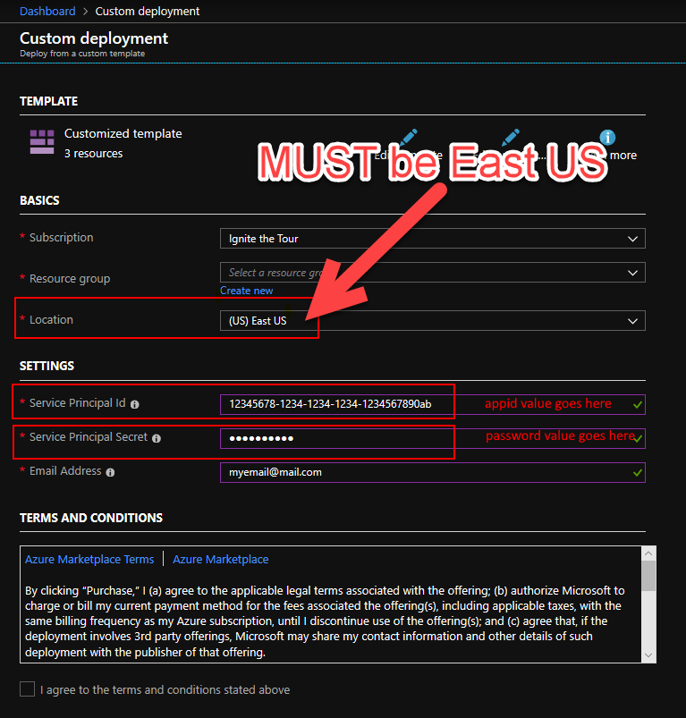
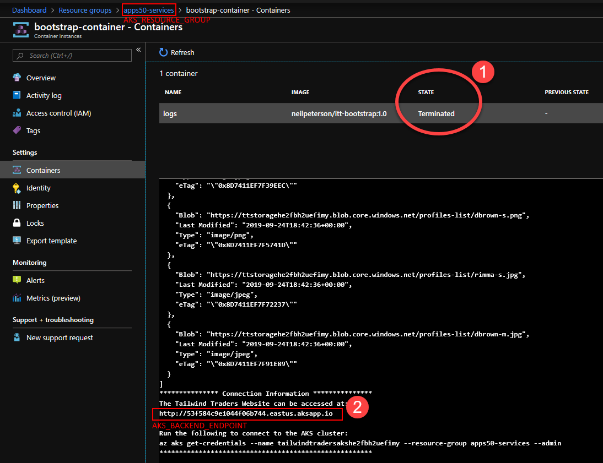
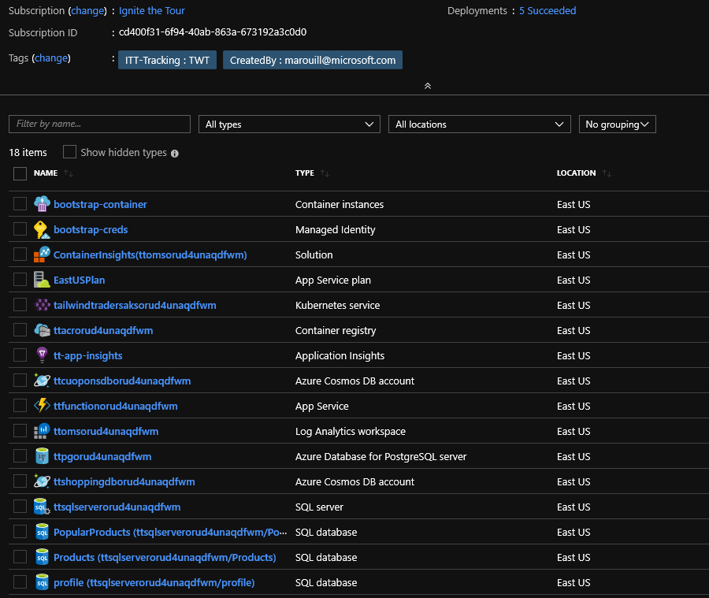
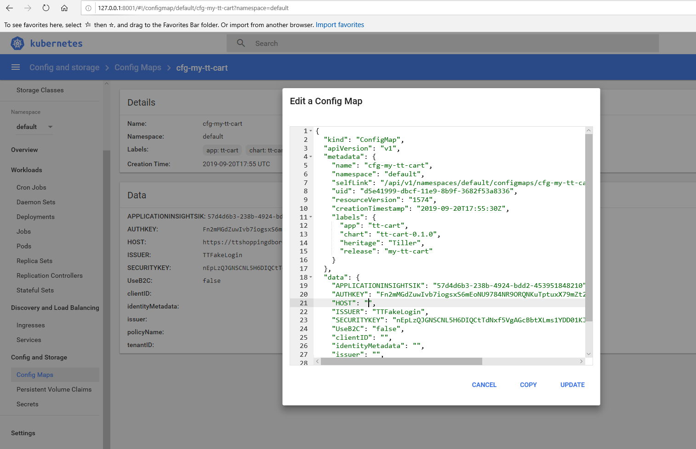
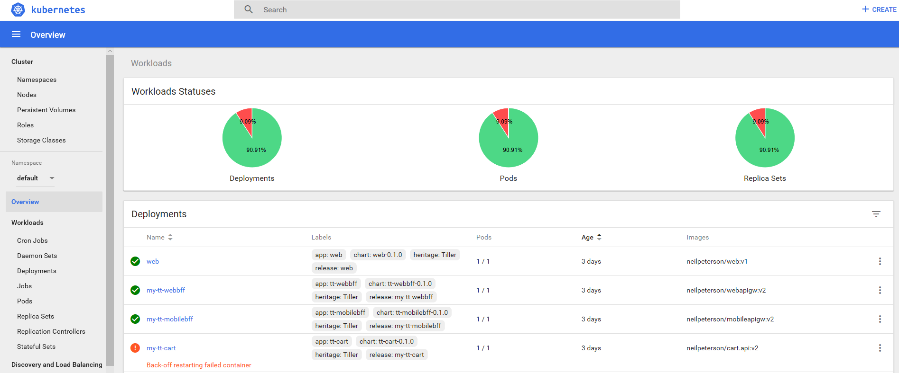

# Deployment

Please be aware that a special environment is required in order to successfully replicate the demos.  The deployment of this environment can take upwards of an hour on the first time through.  Keep this in mind as we want to ensure that you have adequate time before your presentation to familiarize with this process.

To begin, create a text file on your machine named "variables.txt" and pre-fill it with the following:

```ini
AKS_BACKEND_ENDPOINT=
AKS_RESOURCE_GROUP=
AKS_NAME=
HOST=
FRONTEND_RESOURCE_GROUP=
AUSTRALIA_EAST_SITE=
EAST_US_SITE=
AZURE_FD_ENDPOINT=
```

As we progress through the Deployment steps, you will be asked to update values for these variables. This will make it easy to follow along with the demo scripts later on.

First you will need to deploy the Tailwind Traders Reference Deployment into the East US region 

> ⚠️ It is very important that you deploy into the East US region. ⚠️

In order to deploy this template, you need an Azure Service Principal. If you do not have one, you may create one by following the steps below.

Ensure that you have installed the [Azure CLI](https://docs.microsoft.com/en-us/cli/azure/install-azure-cli?view=azure-cli-latest) on your machine.

Login to the azure subscription which contains the deployed resources with:

```bash
az login
```

Retrieve your active accounts with:

```bash
az account list
```

Set the appropriate account (be sure to replace the entirety of `Subscription_Id` with the value of the subscription id containing your deployed AKS instance):

```bash
az account set --subscription Subscription_Id
```

Create the Service Principal with (be sure to replace UNIQUE_VALUE with a unique value):

```bash
az ad sp create-for-rbac --name UNIQUE_VALUE
```

You will see an output similar to:

```json
{
"appId": "12345678-1234-1234-1234-1234567890ab",
"displayName": "apps50serviceprinicpal",
"name": "apps50serviceprinicpal",
"password": "MyPassword",
"tenant": "abcdefgh-abcd-abcd-abcd-abcdefghijkl"
}
```

You will need the values for `appId` and `password` for the next step, an example of where these will be used is shown below:



When you are ready, deploy the backend services by clicking the button below:

[](https://portal.azure.com/#create/Microsoft.Template/uri/https%3A%2F%2Fraw.githubusercontent.com%2Fneilpeterson%2Ftailwind-reference-deployment%2Fmaster%2Fdeployment-artifacts-aks%2Fazuredeploy.json)

This deployment will take around 20 minutes, one of the first items to be deployed into the resource group that you selected is a container instance named `bootstrap-container`.  Navigate to the `bootstap-container` instance in the Azure portal. From the left option panel, under "Settings", click on **Containers**. You will know the deployment is done when the **State** will be **Terminated**

Once the deployment is completed, click the tab "Logs" (in the middle of the screen) and scroll down to the bottom of the log output.  

> Note:
> 
> If in the an ERROR message:
> 
> ```
> "error": {
>   "code": "MissingSubscriptionRegistration",
>   "message": "The subscription is not registered to use namespace 'Microsoft.ContainerService'. See https://aka.ms/rps-not-found for how to register subscriptions.",
>   "details": [
>     {
>       "code": "MissingSubscriptionRegistration",
>       "target": "Microsoft.ContainerService",
>       "message": "The subscription is not registered to use namespace 'Microsoft.ContainerService'. See https://aka.ms/rps-not-found for how to register subscriptions."
>     }
>   ]
> }
> ```
> 
> You  will need to register the namespace with the command: `az provider register -n Microsoft.ContainerService`. This could take a few minutes. You can check the status using the command `az provider show -n Microsoft.ContainerService` and check if **registrationState** is "Registered".
>
> And Same for namespace: 
> - Microsoft.DBforPostgreSQL
> - Microsoft.ContainerRegistry
> 
> You can refer to the documentation to [Resolve errors for resource provider registration](https://docs.microsoft.com/en-us/azure/azure-resource-manager/resource-manager-register-provider-errors?WT.mc_id=msignitethetour2019-github-apps50
)
>


Here you can obtain the values for  `AKS_RESOURCE_GROUP` and `AKS_BACKEND_ENDPOINT`, please store these values in your variables.txt file so that they can be retrieved later.



If the deployment completes successfully, you should end up with the following deployed resources:



Search in this list of resources for the type **Kubernetes service**. Copy the name of the resource in the variables file as `AKS_NAME`. 

---

Demo 4 involves fixing an issue within Azure Kubernetes Services, we need to manually create the issue by performing the steps below.

Install kubectl and follow the instructions to make the program accessible to your `PATH` with:

```bash
az aks install-cli
```

Now we will attempt to access our AKS instance through the kubernetes dashboard using (be sure to replace the entirety of `AKS_RESOURCE_GROUP` and `AKS_NAME` with the appropriate values):

```bash
az aks browse --resource-group AKS_RESOURCE_GROUP --name AKS_NAME
```

The dashboard will attempt to load but you should be met with permissions issues, this is by design.


Close the tunnel by pressing CTRL+C.  Obtain the credentials to connect to your AKS instance with (be sure to replace the entirety of `AKS_RESOURCE_GROUP` and `AKS_NAME` with the appropriate values):

```bash
az aks get-credentials --resource-group AKS_RESOURCE_GROUP --name AKS_NAME
```

Enable access to all services in the Kubernetes dashboard with:

```bash
kubectl create clusterrolebinding kubernetes-dashboard --clusterrole=cluster-admin --serviceaccount=kube-system:kubernetes-dashboard
```

Connect to the now accessible Kuberenetes dashboard running the same command as previously:

```bash
az aks browse --resource-group AKS_RESOURCE_GROUP --name AKS_NAME
```

Front the left side, under "Config and Storage" section, select "Config Maps" => "cfg-my-tt-cart" and select "Edit". Save the value by copying the value of `HOST` to your variables.txt file so that it can be retrieved later, we will refer to this value as `HOST` in the Demo 4 script. 

Finally, edit out this value in the dashboard so that there is nothing there as shown below and click the "Update" button.



Now we just need to restart the my-tt-cart deployment. I a new console use the following commands:

```bash
kubectl scale --replicas=0 deployment my-tt-cart
kubectl scale --replicas=1 deployment my-tt-cart
```

You should be able to verify in the kubernetes dashboard that the cart service is broken in the dashboard (don't worry, we will fix it as part of demo 4)



Next, you will need to deploy the Apps50 specific Frontend resources provided by the "Deploy to Azure" button below:

[](https://portal.azure.com/#create/Microsoft.Template/uri/https%3A%2F%2Fraw.githubusercontent.com%2Fmicrosoft%2Fignite-learning-paths-training%2Fmaster%2Fapps%2Fapps50%2Fdeploy%2Fdeployment.json)

After selecting the subscription, resource group, and location or deployment, you will need to provide a unique value for the following setting:


`Resource Name Suffix` is a value that should consist of text only which is appended to the end of all created resources, ex: if you were to put "deployment" here, it would create the following resources:


Update the value of `FRONTEND_RESOURCE_GROUP` in variables.txt with the value used for the name of the resource group that the frontend resources were deployed to.

An azure app services will be deployed to Australia East region with the url:
"http://tailwindtraders-website-auseast-apps50-" + `Resource Name Suffix` + ".azurewebsites.net"

Store the full value of this url (as http://, not https://) to your variables.txt file as the value for `AUSTRALIA_EAST_SITE`
It is very important that you always visit this url over http and not https during the demos

An azure app services will be deployed to East US region with the url:
"http://tailwindtraders-website-eastus-apps50-" + `Resource Name Suffix` + ".azurewebsites.net"

Store the full value of this url (as http://, not https://) to your variables.txt file as the value for `EAST_US_SITE`
It is very important that you always visit this url over http and not https during the demos

An azure front door instance will be deployed to the url:
"http://tailwind-apps50-" + `Resource Name Suffix` + ".azurefd.net"

Store the full value of this url (as http://, not https://) to your variables.txt file as the value for `AZURE_FD_ENDPOINT`
It is very important that you always visit this url over http and not https during the demos

The deployment can take up to 20 minutes to complete.  When it is finished you should see a set of resources similar to the picture above deployed into the resource group that you selected.

This deployment will purposely deploy a "broken" App Service instance of the Tailwind-Traders Frontend to East US and Australia East which we will fix in Demos 2 & 3.  

Before proceeding to the demos, ensure that you have a file which contains the following variables:

| Variable      | Description |           |
| -------------- | ------------| --------- |
| AKS_BACKEND_ENDPOINT      | The http endpoint to the backend AKS Services  | Required for Demos 2,3,4 |
| AKS_NAME   | The name of the AKS service deployed | Required for Demo 4 |
| AKS_RESOURCE_GROUP   | The name of the resource group that the AKS service is deployed to | Required for Demo 4|
| HOST   | The CosmosDB Endpoint used by AKS for the my-tt-cart service | Required for Demo 4 |
| FRONTEND_RESOURCE_GROUP      | The name of the resource group that the Frontend services are deployed to  | Required for Demos 2,3,4 |
| AUSTRALIA_EAST_SITE      | The http url to the App Service in Australia East  | Required for Demo 3 |
| EAST_US_SITE      | The http url to the App Service in East US  | Required for Demo 3 |
| AZURE_FD_ENDPOINT      | The http endpoint to the Azure front door service  | Required for Demos 1,5 |
